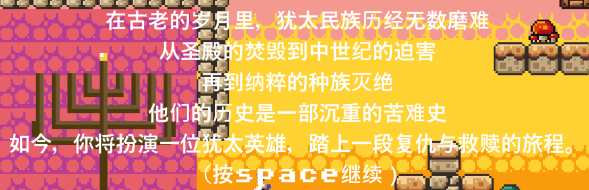

# 信仰之烛：犹太之路

## 游戏简介
《信仰之烛：犹太之路》是为北京大学“全球视野下的犹太文明”课程设计的创意作业。这是一款使用Godot引擎开发的2D横版闯关游戏，旨在通过游戏的形式展现犹太文明的元素和历史背景。

## 游戏元素

### 玩家角色
玩家角色采用犹太传统服饰，头戴Kippah，身披Tallit，体现了犹太文化特色。

*图1：玩家角色设计*

### 蜡烛与烛台
游戏中的蜡烛和烛台元素借鉴了光明节（Hanukkah）的传统习俗。玩家需要在每个关卡中点亮烛台，象征着光明与希望。

*图2：蜡烛与烛台设计*

### 猪
在游戏中，猪被设计为障碍物，玩家需要躲避。这一设计借鉴了犹太教将猪视为不洁动物的观念。

*图3：猪设计*

### 士兵
游戏中的士兵角色象征着历史上十字军对犹太人的压迫。玩家需要与士兵战斗，反抗压迫。

*图4：士兵设计*

### 背景音乐
游戏使用了犹太风格的背景音乐，增强了游戏的文化氛围。

### 地图绘制
游戏地图采用黄色调，与以色列当地地貌一致，增强了游戏的沉浸感。

## 游戏创作历程
最初，作者计划使用PyGame开发游戏，但效果并不理想。在AI的建议下，作者选择了Godot引擎，并在短时间内自学了相关技巧。在短短一周内，作者停掉了大多数专业课程，专注于游戏开发，并搜集了大量犹太元素。最终，作者成功开发出了这款2D横版闯关游戏，并在B站发布了介绍视频。

## 游戏剧情
游戏剧情通过AI辅助和人工修正完成，利用时间轴将各个情节串联起来，展现了犹太人在历史中的抗争与奋斗。

*图5：游戏剧情*

## 游戏演示
游戏的演示视频已发布在B站，您可以点击以下链接观看：
[B站视频介绍](https://www.bilibili.com/video/BV15WLyzzE3h/)

## 如何在Godot中打开和运行游戏
1. **下载游戏文件**  
   从GitHub仓库下载`game_file`文件夹。
   [下载game_file](https://github.com/wjj1234321/godot_game/releases/download/v1.0/game_file.zip)

2. **下载并安装Godot 4**  
   访问[Godot官网](https://godotengine.org/download)下载并安装Godot 4。

3. **导入项目**  
   - 打开Godot 4。
   - 选择左上角的【导入】按钮。
   - 选择下载的`game_file`文件夹。

4. **运行游戏**  
   在Godot中点击【运行】按钮即可开始游戏。

## 如何直接运行游戏
如果你不想在Godot中运行游戏，可以直接下载并运行游戏的可执行文件（exe）。

1. **下载可执行文件**  
   从GitHub仓库下载游戏的可执行文件。

2. **运行游戏**  
   双击下载的`Game.exe`文件即可直接运行游戏。

### 注意事项
- 目前游戏暂不支持iOS系统。
- 确保你的电脑上安装了最新版本的Godot 4，以确保游戏能够正常运行。

## GitHub仓库
游戏的源代码和相关文件已上传至GitHub仓库，您可以通过以下链接访问：
[GitHub仓库](https://github.com/wjj1234321/godot_game)

## 致谢
感谢北京大学“全球视野下的犹太文明”课程的指导，感谢杨梦老师。通过这次游戏开发，我对犹太文明和游戏创作有了更深入的理解和认识。